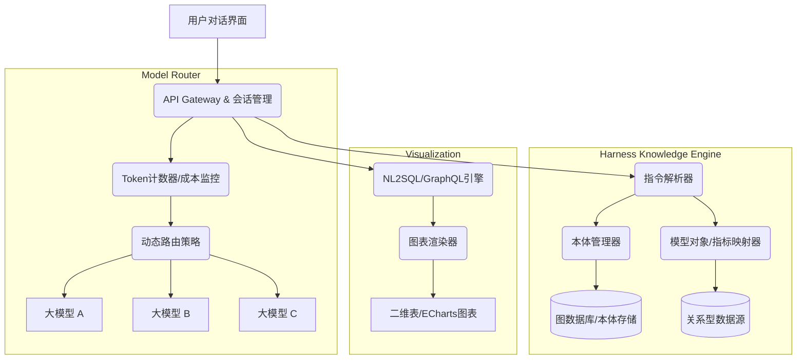

这是一个非常有前瞻性的设计，涵盖了**多模型网关（Model Gateway）**、**Token计量与路由**、**动态知识图谱构建（Harness Ontology）**、以及**NL2SQL/Chart**四个核心模块。

为了帮你把这一复杂系统落地，我将其拆解为**架构设计**、**核心数据模型**、**关键算法逻辑**和**技术栈选型**四个部分，并提供可执行的伪代码逻辑。

---

### 一、 系统总体架构（微服务/模块化）



---

### 二、 核心模块详细设计

#### 1. 多模型配置与Token动态路由
**设计思路**：为每个模型配置权重、成本阈值和速率限制。系统根据当前会话的Token消耗速率自动降级或升级模型。

**数据结构（YAML配置）**：
```yaml
models:
  - name: gpt-4
    provider: openai
    api_key: xxx
    cost_per_1k_tokens: 0.03
    max_input_tokens: 8000
    weight: 30  # 随机权重
    threshold: 0.05 # 单次查询成本超过5美分则切换
    
  - name: claude-3-sonnet
    provider: anthropic
    api_key: yyy
    cost_per_1k_tokens: 0.015
    weight: 50
    threshold: 0.03
```

**Token计量与随机调用逻辑（Python伪代码）**：
```python
import random, tiktoken

class ModelRouter:
    def __init__(self, config):
        self.models = config['models']
        self.encoders = {m['name']: tiktoken.encoding_for_model(m['name']) for m in config}
        
    def count_tokens(self, model_name, text):
        return len(self.encoders[model_name].encode(text))
    
    def select_model(self, prompt, history_cost=0):
        # 1. 随机权重选择（用于A/B测试或负载均衡）
        pool = []
        for m in self.models:
            if history_cost + self.count_tokens(m['name'], prompt)*m['cost_per_1k_tokens']/1000 < m['threshold']:
                pool.extend([m['name']] * m['weight'])
        selected = random.choice(pool) if pool else self.models[0]['name']
        
        # 2. 动态切换逻辑：如果上周期的Token消耗超限，强制降级
        if history_cost > 0.1: # 累计成本超过0.1美元
            selected = [m for m in self.models if 'gpt-3.5' in m['name']][0]
        return selected
```

---

#### 2. “Harness知识库体系”与“本体（Ontology）”设计
**核心概念**：将自然语言指令沉淀为结构化的`实体（Entity）`、`属性（Property）`和`关系（Relation）`。

**固定的指令集（Slash Commands）**：
- `/define 概念` -> 创建本体类
- `/map 字段A -> 字段B` -> 建立映射关系
- `/metric 销售额 = sum(订单.金额)` -> 定义指标公式

**存储层（图数据库 + 关系型映射）**：
```cypher
// 在Neo4j中存储本体
(:Class {name: "客户", alias: "Customer"})
(:Class {name: "订单", alias: "Order"})
(:Property {name: "下单时间", type: "datetime"})
(:Metric {name: "GMV", formula: "sum(Order.amount)", agg: "sum"})

// 关系定义
(:Class)-[:HAS_PROPERTY]->(:Property)
(:Metric)-[:DERIVED_FROM]->(:Class)
```

---

#### 3. 对话动态查询与图表渲染（NL2SQL + Chart）
**工作流**：
1. 用户输入：“查询上个月各个区域的销售额，并用饼图显示占比”
2. 系统将意图拆解为：`意图(查询)` + `维度(区域)` + `指标(销售额)` + `图表类型(饼图)`
3. 通过**本体映射**将“销售额”转换为SQL：`SELECT region, SUM(amount) FROM orders WHERE date > ...`
4. 执行查询并返回JSON数据，根据指令渲染图表。

**动态图表渲染接口设计**：
```python
def render_chart(query_result, chart_type, user_preference):
    if chart_type == "table":
        return build_html_table(query_result)
    elif chart_type == "pie":
        # 自动识别第一列为标签，第二列为数值
        return echarts_pie(query_result[0], query_result[1])
    elif chart_type == "bar":
        return echarts_bar(query_result)
    # 如果用户未指定，利用大模型分析数据特征自动推荐（默认柱状图）
```

---

### 三、 关键技术难点与解决方案

| 难点 | 解决方案 |
| :--- | :--- |
| **Token计量不准** | 不同模型（Claude, Gemini, GPT）Tokenizer不同。使用`tiktoken`(OpenAI)和`transformers`(HuggingFace)的`AutoTokenizer`分别计算，不能统一字符数。 |
| **随机调用导致结果不一致** | 引入**Session亲和性**：同一会话（Session ID）在前3轮对话内固定使用同一个模型，避免上下文丢失导致的逻辑混乱。 |
| **自然语言转SQL（NL2SQL）准确率** | 采用 **“Few-shot + 数据库Schema描述”** 的方式。将`Harness本体定义`作为System Prompt前缀注入，强制大模型仅允许查询已定义的`Class`和`Metric`。 |
| **图表自适应** | 后端只返回`ECharts`或`Chart.js`的`Option` JSON结构，前端仅负责渲染，不参与数据处理，降低耦合。 |

---

### 四、 推荐技术栈选型

- **后端框架**：Python (FastAPI) 或 Java (Spring Boot) —— 推荐FastAPI，便于集成AI SDK。
- **数据库**：
  - **向量/图**：Neo4j（存储本体关系）+ Milvus（存储Embedding，用于语义检索知识）。
  - **关系型**：PostgreSQL（存储指标定义和元数据，支持JSONB）。
- **前端**：React + **ECharts**（图表）+ **Monaco Editor**（代码/配置编辑器）。
- **大模型SDK**：LangChain 或 LlamaIndex（用于封装多模型路由和RAG检索）。

---

### 五、 下一步落地建议（MVP版本）

1. **先跑通“模型路由+Token计算”**，写一个简单的CLI工具验证随机切换和成本熔断。
2. **固化本体定义**：先不急着做动态创建，先在Neo4j里手动建好`Class`和`Metric`，用`/metric`指令去修改属性值。
3. **查询收敛**：限定初期查询只能使用`SELECT ... WHERE ... GROUP BY`，暂不支持多表JOIN，待NL2SQL通过测试后再放开。

如果你需要，我可以为你提供**FastAPI的完整路由代码骨架**，或者**Neo4j的Cypher本体查询模板**，你更倾向于先看哪一部分的具体实现？👇