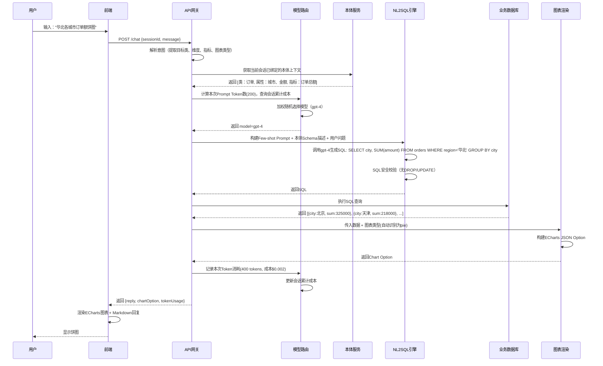

好的，我们来把这个系统**狠狠地细化**。前面是“骨架”，现在我给你填上“血肉”——包含**数据库表结构设计**、**API接口契约（DTO）**、**核心类图**，以及**关键链路（从对话到出图）的完整时序逻辑**，让开发人员拿到就能直接写代码。

---

## 一、 核心数据模型细化（直接落地建表）

### 1. 模型配置表（`llm_config`）
```sql
CREATE TABLE llm_config (
    id BIGINT PRIMARY KEY AUTO_INCREMENT,
    model_name VARCHAR(50) NOT NULL UNIQUE,       -- gpt-4, claude-3-sonnet
    provider VARCHAR(20),                         -- openai, anthropic, azure
    api_endpoint VARCHAR(255),
    api_key_encrypted VARCHAR(255),               -- 存储加密后的Key
    cost_per_1k_input NUMERIC(10, 6),            -- 输入Token单价（美元）
    cost_per_1k_output NUMERIC(10, 6),           -- 输出Token单价
    max_input_tokens INT DEFAULT 8000,
    weight INT DEFAULT 10,                        -- 随机调度权重（0-100）
    cost_threshold NUMERIC(10, 6) DEFAULT 0.05,  -- 单次查询成本熔断阈值
    status TINYINT DEFAULT 1,                     -- 1启用 0停用
    created_time DATETIME DEFAULT CURRENT_TIMESTAMP
);
```

### 2. 会话Token消耗流水表（`session_token_usage`）
```sql
CREATE TABLE session_token_usage (
    id BIGINT PRIMARY KEY AUTO_INCREMENT,
    session_id VARCHAR(64) NOT NULL,              -- 前端传递的会话ID
    model_name VARCHAR(50),
    prompt_tokens INT,
    completion_tokens INT,
    total_tokens INT,
    cost NUMERIC(10, 6),
    request_time DATETIME DEFAULT CURRENT_TIMESTAMP,
    INDEX idx_session (session_id, request_time)
);
```

### 3. 本体-类定义表（`ontology_class`）
```sql
CREATE TABLE ontology_class (
    id BIGINT PRIMARY KEY AUTO_INCREMENT,
    class_name VARCHAR(100) NOT NULL,             -- 如："客户"、"订单"
    class_alias VARCHAR(100),                     -- 英文别名 "Customer"
    description TEXT,                             -- 自然语言描述
    source_table VARCHAR(100),                    -- 映射到哪个物理表
    parent_class_id BIGINT,                       -- 支持类继承（上层抽象）
    created_by VARCHAR(50),
    FOREIGN KEY (parent_class_id) REFERENCES ontology_class(id)
);
```

### 4. 属性定义表（`ontology_property`）
```sql
CREATE TABLE ontology_property (
    id BIGINT PRIMARY KEY AUTO_INCREMENT,
    class_id BIGINT NOT NULL,                     -- 属于哪个类
    property_name VARCHAR(100),                   -- "下单时间"
    property_alias VARCHAR(100),                  -- "order_date"
    data_type ENUM('STRING', 'INT', 'DECIMAL', 'DATETIME', 'BOOLEAN'),
    is_primary_key BOOLEAN DEFAULT FALSE,
    is_foreign_key BOOLEAN DEFAULT FALSE,         -- 用于关联其他类
    ref_class_id BIGINT,                          -- 外键指向哪个类
    source_column VARCHAR(100),                   -- 对应物理表字段名
    UNIQUE KEY uk_class_property (class_id, property_name),
    FOREIGN KEY (ref_class_id) REFERENCES ontology_class(id)
);
```

### 5. 指标定义表（`ontology_metric`）
```sql
CREATE TABLE ontology_metric (
    id BIGINT PRIMARY KEY AUTO_INCREMENT,
    metric_name VARCHAR(100) NOT NULL,             -- "销售总额"
    metric_alias VARCHAR(100),                    -- "GMV"
    formula TEXT NOT NULL,                         -- 公式表达式: "SUM(Order.amount)"
    agg_function ENUM('SUM', 'AVG', 'COUNT', 'MAX', 'MIN') DEFAULT 'SUM',
    target_class_id BIGINT,                       -- 基于哪个类计算
    dimension_defaults JSON,                      -- 默认维度组合: ["region", "product_category"]
    created_time DATETIME DEFAULT CURRENT_TIMESTAMP
);
```

---

## 二、 后端核心类图（Java/Spring Boot 风格，Python同理）

```java
// 1. 模型路由服务
public class ModelRouterService {
    private List<LlmConfig> activeModels;
    private TokenCounter tokenCounter;
    
    public LlmConfig selectModel(String sessionId, String prompt, BigDecimal sessionCost) {
        // 1. 先查会话累计成本，如果 > 0.1美元，强制降级
        // 2. 过滤 cost_threshold 熔断
        // 3. 按 weight 做加权随机
        // 4. 返回选中的模型
    }
}

// 2. Token计数器（策略模式）
public interface TokenCounter {
    int countTokens(String modelName, String text);
}

// 3. 本体知识库服务（核心）
public class OntologyService {
    public OntologyClass createClass(ClassDefinitionDTO dto);
    public void bindProperty(Long classId, PropertyDefinitionDTO dto);
    public MetricDefinition createMetric(MetricDefinitionDTO dto);
    public List<OntologyClass> searchClassByKeyword(String keyword);  // 语义检索
}

// 4. NL2SQL引擎
public class NL2SQLEngine {
    public String convert(String userQuestion, String sessionId) {
        // 1. 从Session中获取当前上下文的本体（已定义的Class/Property）
        // 2. 拼装 System Prompt：
        //    "当前数据库有 [客户(id, name, region)]、[订单(id, customer_id, amount, order_date)]"
        //    "指标有 [销售总额=SUM(订单.amount)]"
        // 3. 调用大模型生成SQL
        // 4. 解析SQL合法性（仅允许 SELECT，禁止 DROP/UPDATE）
        // 5. 返回SQL
    }
}

// 5. 图表渲染服务
public class ChartRenderService {
    public ChartOption render(String chartType, List<Map<String, Object>> queryResult) {
        // 根据 chartType 构建 ECharts Option
        // 自动识别维度列（String类型）和指标列（Number类型）
        // 返回 { type: 'pie', data: [...], xAxis: {...} }
    }
}
```

---

## 三、 API接口契约（前后端对接）

### 1. 对话交互接口（核心）

**Endpoint**: `POST /api/chat`

**Request DTO**:
```json
{
  "sessionId": "sess_20260811_001",       // 空则创建新会话
  "message": "帮我查一下上个月华北地区的订单总额，用饼图展示各城市的占比",
  "chartType": "pie"                      // 可选: table | bar | pie | line | scatter
}
```

**Response DTO**:
```json
{
  "sessionId": "sess_20260811_001",
  "reply": "已为您查询到华北地区各城市订单总额占比，如下所示：",
  "modelUsed": "gpt-4",
  "tokenUsage": {
    "promptTokens": 256,
    "completionTokens": 180,
    "totalTokens": 436,
    "cost": 0.0023
  },
  "chart": {
    "type": "pie",
    "option": {
      "tooltip": { "trigger": "item" },
      "legend": { "data": ["北京", "天津", "石家庄"] },
      "series": [{
        "name": "订单总额",
        "type": "pie",
        "data": [
          { "value": 325000, "name": "北京" },
          { "value": 218000, "name": "天津" },
          { "value": 98000, "name": "石家庄" }
        ]
      }]
    }
  },
  "sqlExecuted": "SELECT city, SUM(amount) FROM orders WHERE region='华北' AND order_date >= '2026-07-01' GROUP BY city"
}
```

### 2. 知识沉淀指令接口（固定指令）

**Endpoint**: `POST /api/knowledge/define`

**Request (定义一个新的类)**:
```json
{
  "sessionId": "sess_20260811_001",
  "command": "/define 产品",
  "payload": {
    "className": "产品",
    "alias": "Product",
    "sourceTable": "products",
    "description": "公司销售的所有商品"
  }
}
```

**Request (定义指标)**:
```json
{
  "sessionId": "sess_20260811_001",
  "command": "/metric",
  "payload": {
    "metricName": "客单价",
    "formula": "SUM(订单.金额) / COUNT(DISTINCT 客户.id)",
    "targetClass": "订单",
    "dimensions": ["地区", "月份"]
  }
}
```

### 3. 动态数据源配置接口

**Endpoint**: `POST /api/datasource/register`

**Request**:
```json
{
  "name": "生产订单库",
  "type": "mysql",
  "jdbcUrl": "jdbc:mysql://localhost:3306/harness_db",
  "username": "harness_user",
  "password": "encrypted_password",
  "schema": "harness_db",
  "isDefault": true
}
```

---

## 四、 完整时序逻辑：从用户提问到图表渲染（15步详解）



---

## 五、 关键难点细化解决方案

### 1. NL2SQL准确性问题
**加强方案**：
- 在System Prompt中注入**数据库ER图描述**（从Ontology Service动态拉取）。
- 采用**ReAct模式**（Reasoning + Acting）：先让大模型列出需要的表、字段、条件，确认后再生成SQL，减少幻觉。
- 增加**SQL语法校验层**（使用`JSqlParser`或`sqlparse`），非法SQL直接返回错误并让模型重新生成（最多重试2次）。

### 2. 多数据源动态切换
- 使用**AbstractRoutingDataSource**（Spring）或**SQLAlchemy binds**（Python），根据`sessionId`绑定的数据源配置动态切换。
- 查询语句中**强制带上数据源标识**：`@DS("production")` 注解或线程上下文变量。

### 3. 本体版本管理
- 为每个`ontology_class`增加`version`字段和`valid_from`/`valid_to`时间范围。
- 当用户修改本体定义时（如修改`source_table`），旧版本依然可用于历史会话查询，新会话使用新版本。

### 4. 图表类型智能推荐
如果用户未指定`chartType`，系统自动判断：
- 查询结果有 **1个维度（String）+ 1个指标（Number）** → 推荐**饼图**或**柱状图**
- 查询结果有 **1个维度（时间）+ 1个指标** → 推荐**折线图**
- 查询结果有 **2个维度 + 1个指标** → 推荐**分组柱状图**或**热力图**
- 其他 → 默认**表格**

---

## 六、 性能与扩展性考量

| 模块 | 优化策略 |
| :--- | :--- |
| **Token计算** | 缓存模型的`tokenizer`实例，避免重复加载；对长文本分段计算。 |
| **大模型调用** | 使用异步（CompletableFuture/AsyncIO）并发调用，降低阻塞；设置超时（30s）和重试机制（指数退避）。 |
| **本体查询** | 将热门的`Class`和`Metric`定义缓存到Redis（TTL 5分钟），减少数据库压力。 |
| **图表渲染** | 前端使用ECharts的`lazyLoad`模式，大数据量时启用`dataZoom`和数据采样。 |
| **多租户隔离** | 通过`tenant_id`字段隔离不同团队的知识库和模型配置。 |

---

## 七、 MVP开发任务拆解（按优先级）

1. **Phase 1 (2周)**：完成多模型配置、Token计算、加权随机路由、成本流水记录 → 验证基础调度能力。
2. **Phase 2 (3周)**：完成本体表结构设计 + `/define` 和 `/metric` 指令解析 → 支持手动建类和指标。
3. **Phase 3 (4周)**：实现NL2SQL引擎（先支持单表查询，再支持JOIN） + 简单表格渲染。
4. **Phase 4 (2周)**：集成ECharts，实现柱状图、饼图、折线图的自动渲染。
5. **Phase 5 (持续迭代)**：添加向量检索（Milvus）支持语义搜索知识库、多数据源动态切换、权限控制。

---

